# 🏥 MediCare Pro — Hospital Management SaaS

> AI-powered, Multi-Tenant Hospital Management System built with Next.js 14, TypeScript & MongoDB


## 🔴 Live Demo
👉 [medicare-pro.vercel.app](https://medicare-pro.vercel.app)

## 👥 Demo Credentials

| Role | Email | Password |
|------|-------|----------|
| Super Admin | superadmin@medicare.com | super123 |
| Admin | admin@medicare.com | admin123 |
| Doctor | doctor@medicare.com | doctor123 |
| Patient | patient@medicare.com | patient123 |
| Receptionist | reception@medicare.com | recep123 |
| Lab Staff | lab@medicare.com | lab123 |

## ✨ Features

- 🏥 **Multi-Tenant Architecture** — Multiple hospitals, isolated data
- 👑 **7 User Roles** — Super Admin, Admin, Doctor, Nurse, Receptionist, Lab, Patient
- 🤖 **AI Prescriptions** — Groq AI powered diagnosis & prescription
- 🧪 **Lab Management** — Tests, reports, PDF download
- 💰 **Billing** — JazzCash, EasyPaisa, Cash payments
- 📊 **Analytics Dashboard** — Revenue, appointments, KPIs
- 📄 **PDF Generation** — Prescriptions, lab reports, invoices
- 📱 **Mobile Responsive** — Works on all devices

## 🛠 Tech Stack

- **Frontend:** Next.js 14, TypeScript, Tailwind CSS
- **Backend:** Next.js API Routes, MongoDB, Mongoose
- **Auth:** JWT, HttpOnly Cookies
- **AI:** Groq AI (LLaMA 3)
- **PDF:** jsPDF, jspdf-autotable

## 🚀 Local Setup

```bash
git clone https://github.com/muhammadhasnain3031/medicare-pro
cd medicare-pro
npm install
cp .env.example .env.local

npm run dev
```

## 📸 Screenshots
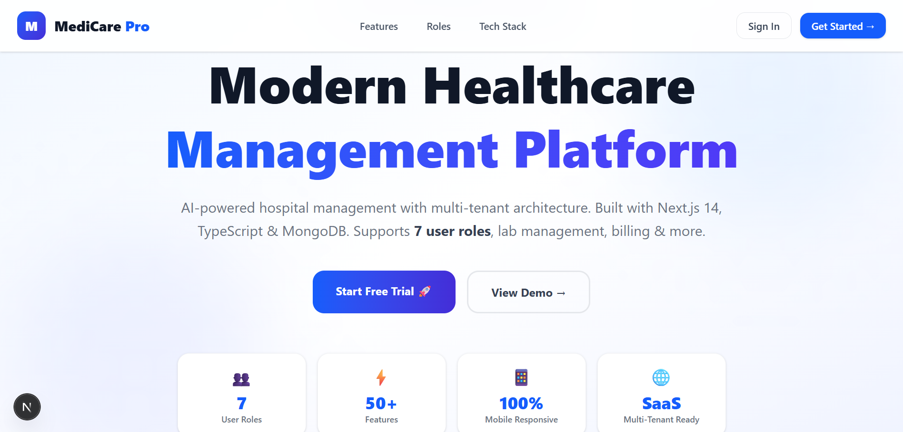
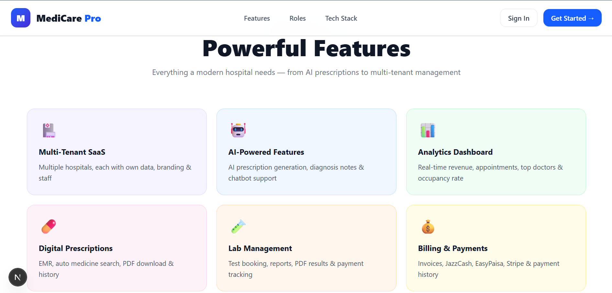
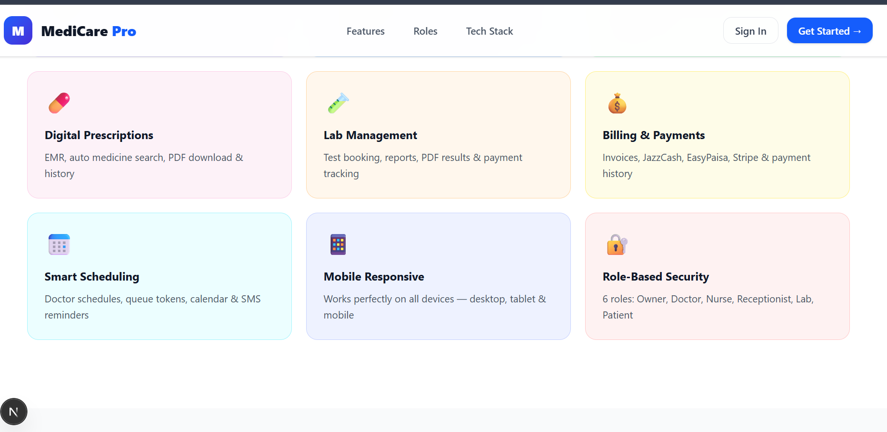
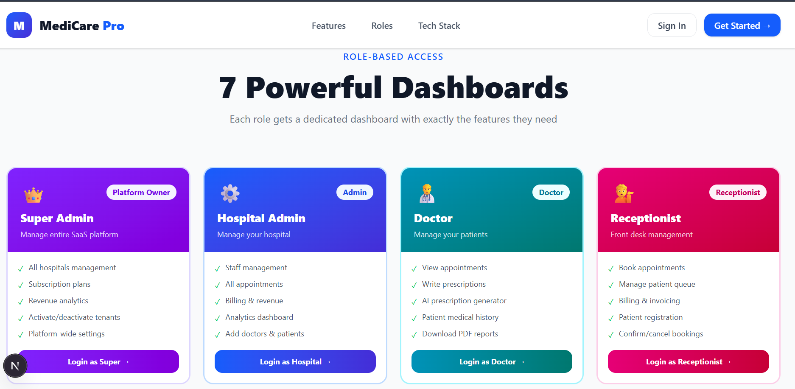
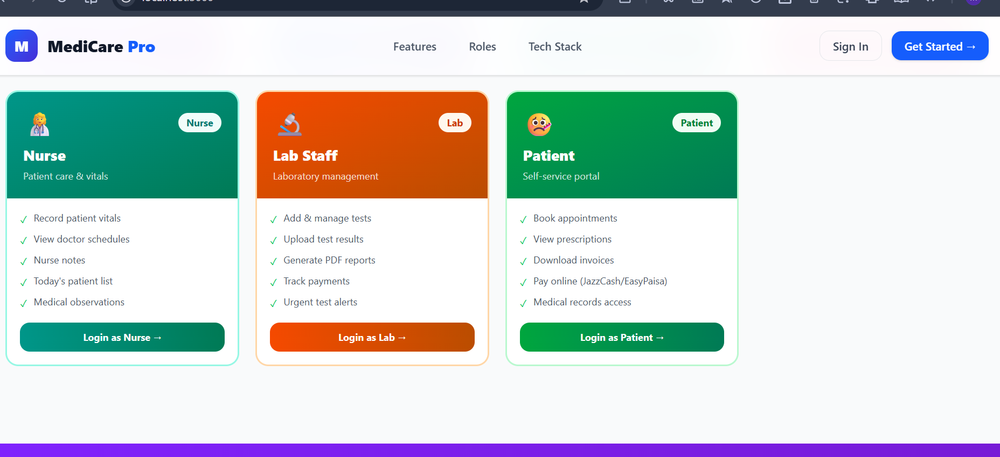
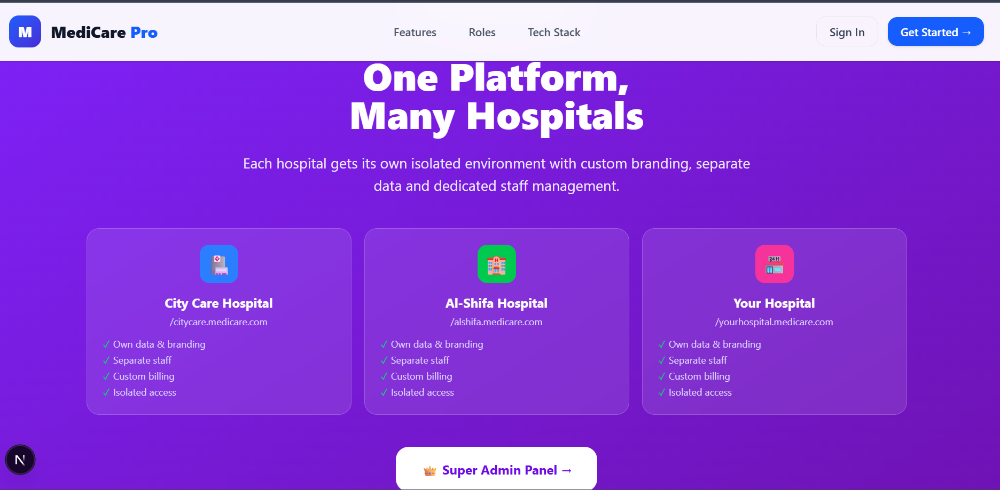
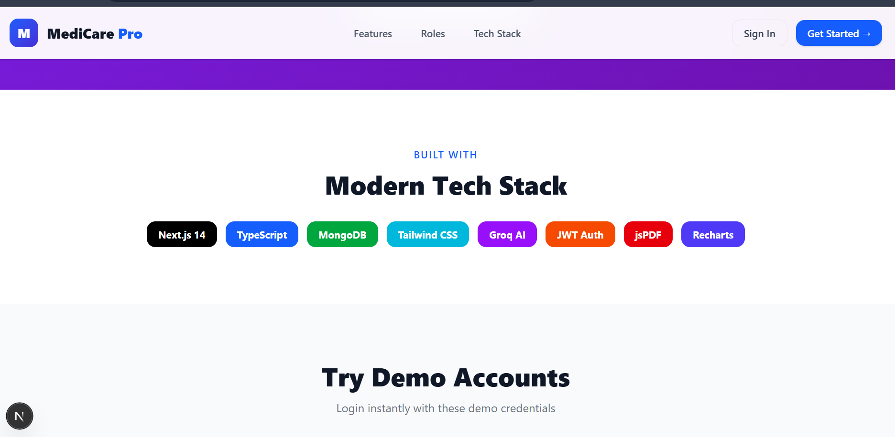
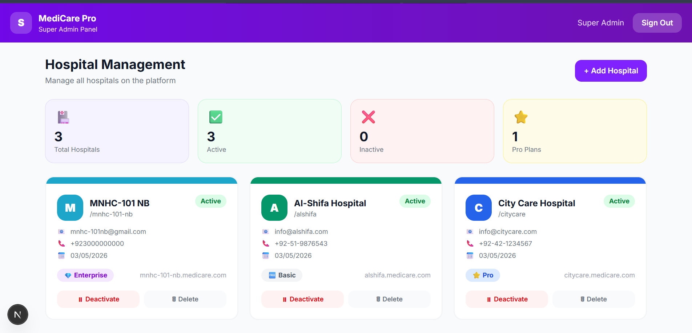
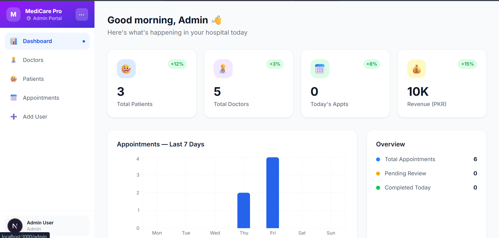
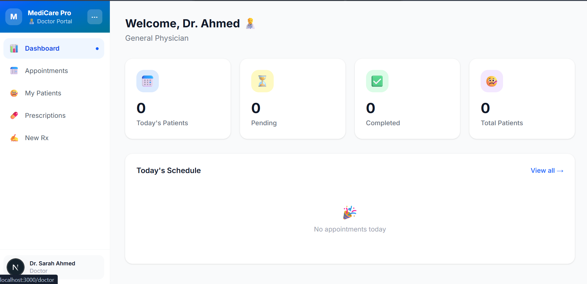
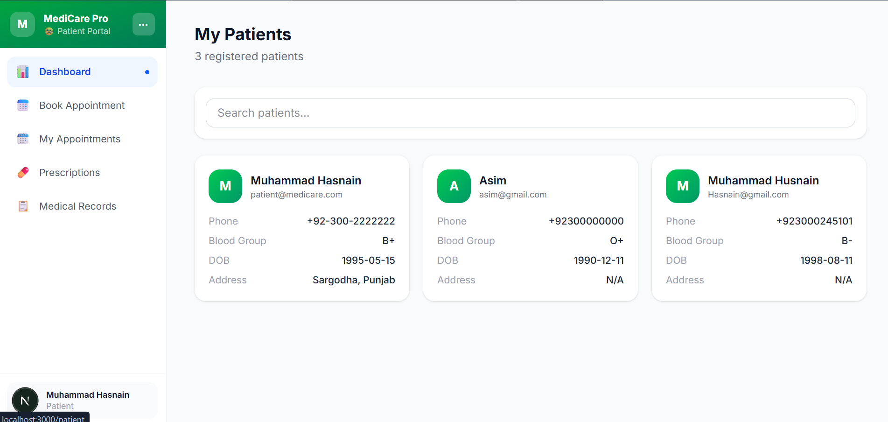
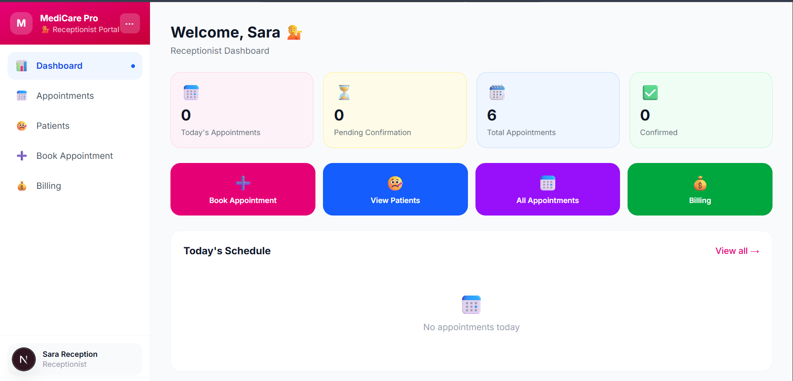
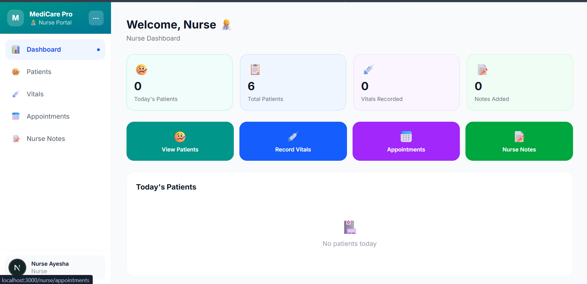
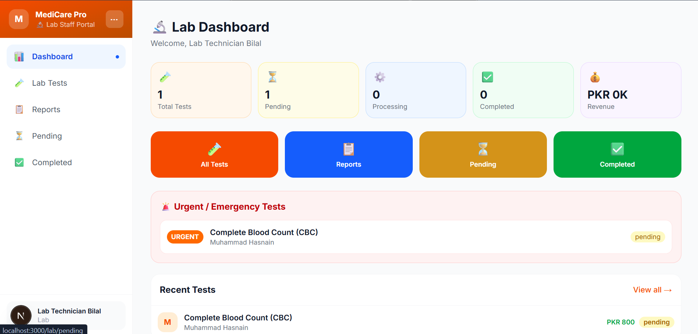
## 👨‍💻 Developer
**Muhammad Hasnain** — Full Stack MERN Developer
- GitHub: [@muhammadhasnain3031](https://github.com/muhammadhasnain3031)
- LinkedIn: [muhammad-hasnain-dev](https://linkedin.com/in/muhammad-hasnain-dev)